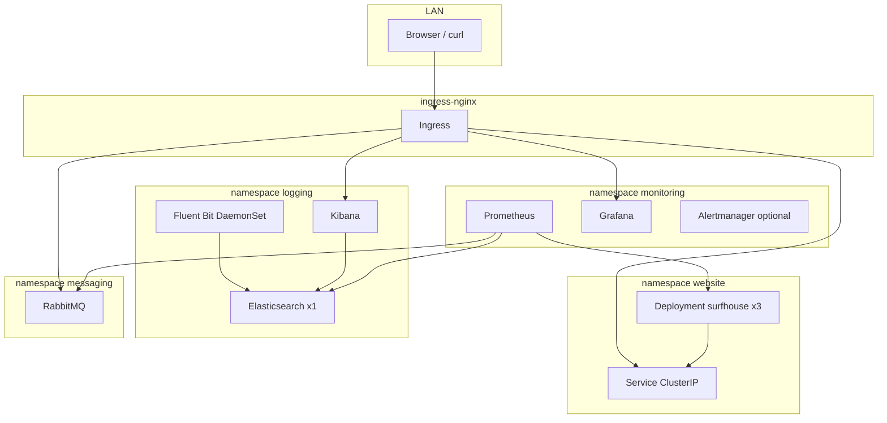
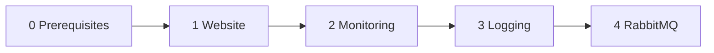

# План: homelab Kubernetes — от сайта до RabbitMQ

## Контекст

| Что уже есть | Что ещё нет |
|--------------|-------------|
| Кластер kubeadm 1.31 + Flannel ([Ansible](file:///home/drozd/homelab/Ansible)) | Манифесты в [K8s/](file:///home/drozd/homelab/K8s) (папка пустая) |
| 1 master (4 GB) + 3 workers (6 GB) | Ingress, StorageClass, metrics-server |
| Namespaces: `website`, `monitoring`, `logging`, `messaging` | Приложения внутри namespaces |

**Ограничение по RAM:** на воркерах суммарно ~18 GB под поды. Полноценный HA-ELK + Prometheus «как в проде» не влезет. План рассчитан на **учебные минимальные** размеры с жёсткими `resources` и одним узлом Elasticsearch.



---

## Что вы изучите на каждом этапе

| Этап | Зачем это в k8s | Ключевые объекты |
|------|-----------------|------------------|
| 0. Платформа | Без Ingress и дисков остальное неудобно | Helm/kubectl, DaemonSet/Deployment Ingress |
| 1. Сайт | Базовый цикл «образ → поды → трафик» | Deployment, Service, Ingress, probes |
| 2. Мониторинг | Метрики и дашборды; кто «здоров» | ServiceMonitor, Prometheus, Grafana, PVC |
| 3. Логи | Централизованный поиск по логам подов | DaemonSet, StatefulSet, PVC, index pattern |
| 4. Очереди | Асинхронный обмен сообщениями | StatefulSet, Secret, Service, Ingress |

---

## Структура репозитория (создадим при реализации)

```
K8s/
├── README.md                 # порядок установки, /etc/hosts, проверки
├── 00-prerequisites/
│   ├── ingress-nginx/        # Helm values или manifest pin
│   ├── local-path-provisioner/
│   └── metrics-server/
├── 01-website/
│   ├── deployment.yaml
│   ├── service.yaml
│   └── ingress.yaml
├── 02-monitoring/
│   └── kube-prometheus-stack-values.yaml
├── 03-logging/
│   ├── elasticsearch-values.yaml   # Bitnami, 1 реплика
│   ├── kibana-values.yaml
│   └── fluent-bit-values.yaml        # вместо тяжёлого Logstash на старте
└── 04-messaging/
    └── rabbitmq-values.yaml
```

Рабочая машина: `kubectl` + `helm` с kubeconfig с master (`scp ubuntu@10.10.10.124:~/.kube/config ~/.kube/config-homelab`).

---

## Этап 0: Платформа (обязательно перед всем)

### 0.1 Ingress NGINX

- Установка: Helm chart `ingress-nginx/ingress-nginx` в namespace `ingress-nginx`.
- Тип Service: **NodePort** или **hostNetwork** — для homelab проще NodePort на фиксированном порту (например 30080) и в `/etc/hosts` не указывать порт, если Ingress слушает 80 через `hostPort` / отдельную настройку; **практичный вариант**: Ingress controller Service type `NodePort`, HTTP на порту **30080**, в браузере `http://surfhouse.local:30080` **или** patch DaemonSet/hostNetwork — в README зафиксируем один выбранный вариант (рекомендация: **NodePort 30080** + запись в hosts на IP любого worker).

### 0.2 StorageClass

- [local-path-provisioner](https://github.com/rancher/local-path-provisioner) — PVC на локальном диске ноды; достаточно для Grafana, ES, RabbitMQ в учебных целях.
- Проверка: `kubectl get storageclass` → default StorageClass.

### 0.3 metrics-server

- Нужен для `kubectl top pods/nodes` и опционального HPA позже.
- Установка manifest из release Kubernetes metrics-server (с `--kubelet-insecure-tls` если self-signed на kubeadm — типично для homelab).

**Проверка этапа 0:** `kubectl get pods -A`, Ingress controller Running, тестовый Ingress на `whoami` или `httpbin` (можно удалить после).

---

## Этап 1: Сайт `veselijdrozd/surfhouse:latest` (namespace `website`)

**Цель:** 3 реплики nginx, доступ с LAN по имени.

### Манифесты (чистый YAML — лучше для обучения)

- **Deployment**
  - `replicas: 3`
  - `image: veselijdrozd/surfhouse:latest`, `imagePullPolicy: Always`
  - `resources`: requests `64Mi/50m`, limits `128Mi/200m`
  - `livenessProbe` / `readinessProbe`: HTTP GET `/` port 80
  - **preferredPodAntiAffinity** по `kubernetes.io/hostname` — по возможности по одному поду на worker
- **Service** `ClusterIP`, port 80 → targetPort 80
- **Ingress**
  - host: `surfhouse.local`
  - path `/` → service `surfhouse`
  - class: `nginx`

### Записи на ПК с браузером

```
10.10.10.122  surfhouse.local grafana.local kibana.local rabbitmq.local
```

(IP — любой worker; при NodePort добавить `:30080` в URL, если так настроим Ingress.)

**Проверка:** `kubectl get pods -n website -o wide`, `curl -H 'Host: surfhouse.local' http://<worker-ip>:<ingress-port>/`

**Идеи для экспериментов:** `kubectl scale deployment`, `kubectl rollout restart`, посмотреть распределение подов по нодам.

---

## Этап 2: Prometheus + Grafana (namespace `monitoring`)

**Зачем:** Prometheus собирает метрики (CPU, память, HTTP, состояние подов); Grafana рисует графики и алерты.

### Установка

- Helm: [kube-prometheus-stack](https://github.com/prometheus-community/helm-charts/tree/main/charts/kube-prometheus-stack) (один chart: Prometheus Operator + Prometheus + Grafana + node-exporter + kube-state-metrics).
- Values с урезанием ресурсов под 6 GB workers, например:
  - Prometheus: retention `2d`, PVC `5Gi`, memory limit ~1–1.5Gi
  - Grafana: PVC `2Gi`, memory ~256–512Mi
  - Отключить или урезать компоненты, которые не нужны на старте (например часть default rules / alertmanager replicas: 1 с малыми limits)

### Ingress

- `grafana.local` → Service `kube-prometheus-stack-grafana`
- Логин/пароль: из Secret chart'а (`admin-user` / `admin-password`) — задокументировать в README.

### Связь с сайтом

- kube-prometheus-stack по умолчанию скрейпит поды с аннотациями `prometheus.io/scrape` **или** через ServiceMonitor CRD.
- Для nginx без встроенного `/metrics` достаточно метрик **kubelet/cAdvisor** (CPU/RAM pod) и **blackbox** (опционально позже). На первом проходе — дашборды **Kubernetes / Node / Pod** из Grafana.

**Проверка:** Targets в Prometheus UI (port-forward), дашборд pod'ов `website`.

---

## Этап 3: Логирование — учебный стек на базе ELK (namespace `logging`)

**Зачем:** логи всех контейнеров в одном месте; поиск в Kibana.

### Прагматичная архитектура под ваш RAM

Классический **E+L+K** с Logstash на 3×6 GB — риск OOM. Для обучения:

| Компонент | Роль | Как ставим |
|-----------|------|------------|
| **Fluent Bit** | Сбор логов с `/var/log/containers` на каждой ноде | Helm `fluent/fluent-bit`, output → Elasticsearch |
| **Elasticsearch** | Хранение и поиск | Bitnami chart, **1 реплика**, JVM heap **512m**, PVC 5–8Gi |
| **Kibana** | UI | Bitnami chart, Ingress `kibana.local` |
| **Logstash** | Парсинг/обогащение | **Фаза 3b** (опционально), 1 реплика, малые limits — только после стабильной работы ES+Fluent Bit |

Так вы понимаете **полный пайплайн логов в k8s**; Logstash добавляется как «вишенка», когда ES не падает по памяти.

### Шаги

1. Elasticsearch + Kibana (Bitnami или ECK — для простоты **Bitnami** в учебном плане).
2. Fluent Bit DaemonSet → Elasticsearch service URL `https://elasticsearch.logging.svc:9200` (или http без TLS на homelab).
3. В Kibana: Index pattern `kubernetes-*` или `logstash-*` (зависит от префикса Fluent Bit).
4. Сгенерировать трафик на `surfhouse` и найти логи в Discover.

**Мониторинг логов:** позже можно добавить scrape Elasticsearch exporter в Prometheus (не обязательно на старте).

**Проверка:** логи pod'а `surfhouse` видны в Kibana за последние 15 минут.

---

## Этап 4: RabbitMQ (namespace `messaging`)

**Зачем:** брокер очередей (publish/consume), UI управления, persistence.

### Установка

- Helm: `bitnami/rabbitmq` в `messaging`.
- Values: 1 реплика (учебно), PVC `2Gi`, включить `management` plugin, задать user/password через existing Secret.
- **Ingress** `rabbitmq.local` → management UI (порт 15672).
- Resources: requests ~256Mi, limits ~512Mi–1Gi.

### Минимальный учебный сценарий (после установки)

- `kubectl run` временный pod с `rabbitmqadmin` или Python/sklearn script publish/consume — не обязательно в репо, описать в README командами.
- Связь с мониторингом: RabbitMQ exporter или встроенные метрики Bitnami + ServiceMonitor.

**Проверка:** UI открывается, очередь создаётся, сообщение проходит.

---

## Рекомендуемый порядок и нагрузка на кластер



| После этапа | Ориентир RAM на workers |
|-------------|-------------------------|
| 1 Website | + ~300 MB |
| 2 Monitoring | + ~2–3 GB |
| 3 Logging | + ~2–3 GB (ES — узкое место) |
| 4 RabbitMQ | + ~0.5 GB |

Если `kubectl top nodes` показывает давление на память — **сначала** уменьшить retention Prometheus / heap ES, **потом** добавлять Logstash.

**Важно:** не снимать taint с master без необходимости; тяжёлые StatefulSet держать на workers через `nodeSelector` при необходимости.

---

## /etc/hosts (итоговый шаблон)

На вашем Linux/macOS/Windows:

```
10.10.10.122  surfhouse.local grafana.local kibana.local rabbitmq.local
```

Порт в URL — по тому, как настроим Ingress (зафиксируем в [K8s/README.md](file:///home/drozd/homelab/K8s/README.md) при реализации).

---

## Команды-шпаргалка (будут в README)

```bash
export KUBECONFIG=~/.kube/config-homelab
kubectl get pods -A
kubectl -n website logs -l app=surfhouse --tail=50
kubectl -n website describe ingress
helm list -A
```

---

## Риски и как их обойти

| Риск | Митигация |
|------|-----------|
| OOM на workers из-за ES + Prometheus | Жёсткие limits; 1 реплика ES; короткий retention; этап 3 после проверки `kubectl top` |
| `:latest` тянет неожиданный образ | Для прод позже зафиксировать digest/tag |
| Нет TLS на Ingress | Нормально для homelab; не выставлять наружу в интернет |
| Flannel + нет NetworkPolicy | На обучение OK; позже Calico/Cilium + policies |

---

## Что НЕ входит в первый проход (осознанно)

- GitOps (Argo CD), CI/CD, cert-manager/Let's Encrypt
- HA Elasticsearch (3 ноды), отдельный кластер Logstash
- HPA/VPA для surfhouse
- Отдельный Ansible для приложений (только kubectl/helm из репо K8s)

Это можно добавить как «уровень 2» после стабильного базового стека.

---

## Реализация после утверждения плана

1. Создать дерево файлов в [K8s/](file:///home/drozd/homelab/K8s) и README с пошаговыми командами.
2. Применить этапы 0→4 на кластере (с вашего ПК или с master).
3. После каждого этапа — чеклист проверки в README.
4. Краткие комментарии в values.yaml **на русском** (что делает каждый блок) для обучения.
